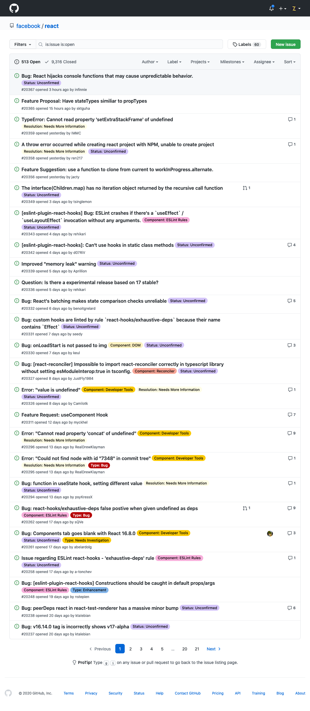
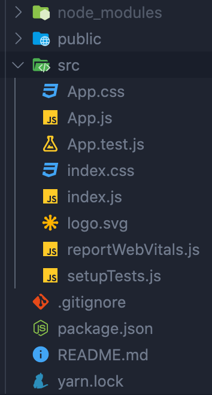

# Objective

  Create an initial page that displays the github issues to your repository.

If you were to look at an issues page, there’s a lot going on but we’re only interested in the issues part.

Here is a stripped down version of facebook/react’s repository.

To re-create this page, I would ask you to follow these steps. Preferably making at least a commit at every step. (this is mainly to help you roll back if necessary without losing progress)

## Required Steps:

1. Define a core library which will be responsible for all all the logic relating to making an api call.

   - @ /src/lib/api

2. Using the Containtainer/Presentation component pattern, create a container that makes an api call.

   - @ /src/containers/

3. This container will then pass the data to a IssueList component which will generate several IssueCard components.
4. The card issue component will display the title, #number, how long ago it was created, author, a comment count, status for open and closed.

   - The title should have a hover effect and an empty link going to href=”#”
   - @ /src/components/

## Project setup

1. Install nodejs, preferably via nvm.
2. npm comes with nodejs.
3. Install the create-react-app utility.
4. Create a new CRA app using the default settings.

> No other packages are required to proceed. You can use a UI kit or css framework if you wish, but they are entirely optional.
> Using Axios is not required, if you have not used axios nor fetch, default to fetch (native api).

## Project Structure

A fresh CRA will generate the following project structure.

- All code should be inside src.
- All assets should be inside public (including the index.html)

We’ll apply a few changes to this structure:

- We’ll create 3 new folders inside src/:
  - components/
  - lib/
  - containers/
- Both containers and components will hold components (of different types).
- When defining a new component, create a folder with the component’s name using PascalCase. Inside the folder create a file with the component’s name also using PascalCase with the .jsx extension.
- Your project will likely have a package-lock.json instead of a yarn.lock. They are respectively for npm and yarn which are two package managers. I recommend starting with npm, the default. (also because it doesn’t make much difference anymore)
- Feel free to delete the reportWebVitals.js file.
- Do not delete the app.test.js and setupTests.js. We’ll need these later.

## Next Week:

React Router, the /src/pages directory, /src/pages/list & /src/pages/issue.

# Review so far:

## Giulia

- Work on better separation of concerns by splitting your issue component into /src/lib/api/github.js, a container using the lib and passing data to a view component.
- Each of your “renderXYZ” function, should be its own component.

## Marco

- Remove next.js

## Matteo

- Work on making the api call
